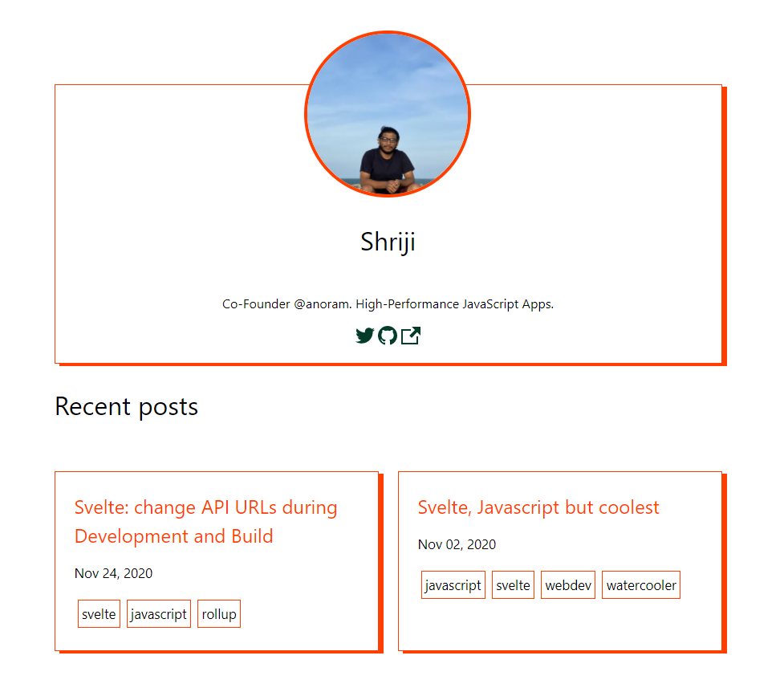

# DEV to Sapper Portfolio/Personal blog generator

<p align="center">
  <br>
  
  <br>
  <br>
</p>

You can check out the deployed Sapper app at [https://blog.shriji.xyz/](https://blog.shriji.xyz/)

**Note: Following these steps will result in charges for the use of DigitalOcean services**

## Requirements

* You need a DigitalOcean account. If you don't already have one, you can sign up at https://cloud.digitalocean.com/registrations/new
    
## Development and Forking 

Fork/clone this repo and create a new `.env` file with variables in the provided `.envsample`.

```
npm install
#yarn install

#develop like any other Sapper app
```

Issues and PRs are welcome :)

## Deploying the App ##

Click this button to deploy the app to the DigitalOcean App Platform.

 [](https://cloud.digitalocean.com/apps/new?repo=https://github.com/peopledrivemecrazy/dev-to-sapper/tree/main)

**Note: Once you begin to deploy there is a step where you need to supply your environment variables check `.envsample` for the format**

## Making Changes to Your App ##

As long as you left the default Autodeploy option enabled when you first launched this app, you can now make code changes and see them automatically reflected in your live application. During these automatic deployments, your application will never pause or stop serving request because the App Platform offers zero-downtime deployments.

## Learn More ##

You can learn more about the App Platform and how to manage and update your application at https://www.digitalocean.com/docs/apps/.


## Deleting the App #

When you no longer need this sample application running live, you can delete it by following these steps:
1. Visit the Apps control panel at https://cloud.digitalocean.com/apps
1. Navigate to the sample-nuxtjs app
1. Choose "Settings"->"Destroy"

This will delete the app and destroy any underlying DigitalOcean resources

**Note: If you don't delete your app, charges for the use of DigitalOcean services will continue to accrue.**


